<!-- ═══════════════════════════════════════════════════════════════════════
     BANNER
════════════════════════════════════════════════════════════════════════ -->

  

 

<!-- ═══════════════════════════════════════════════════════════════════════
     TYPING ANIMATION + STATUS
════════════════════════════════════════════════════════════════════════ -->

  

&nbsp;

&nbsp;

 

---

<!-- ═══════════════════════════════════════════════════════════════════════
     ABOUT ME
════════════════════════════════════════════════════════════════════════ -->
## 👨‍💻 ABOUT ME:

- 👋 Hi, I'm [@Rafsan41](https://github.com/Rafsan41)
- 🔭 Currently working on **React.js, Next.js & TypeScript** for frontend development
- ⚙️ Using **Node.js, Express.js, MongoDB, PostgreSQL, and Prisma** for the backend
- 🌱 Currently learning **React Native, GraphQL, Docker and AWS**
- 💬 Ask me about **Full-Stack (React, Next, Node, Express, MongoDB, PostgreSQL)**
- 🌐 Explore My Portfolio [rafsandev.vercel.app](https://rafsandev.vercel.app)
- 💼 I regularly connect on [LinkedIn](https://www.linkedin.com/in/rafsan-dipto)
- 📫 Feel free to reach me out [rafsundipto116@gmail.com](mailto:rafsundipto116@gmail.com)

---

<!-- ═══════════════════════════════════════════════════════════════════════
     SOCIALS
════════════════════════════════════════════════════════════════════════ -->
## 📱 FOLLOW ME ON SOCIALS:

  
  &nbsp;
  
  &nbsp;
  
  &nbsp;
  

 

---

<!-- ═══════════════════════════════════════════════════════════════════════
     TECH STACK
════════════════════════════════════════════════════════════════════════ -->
## 🛠️ TECHNOLOGY STACK:

**Languages:**

  

**CSS Frameworks & Libraries:**

  

**JavaScript Frameworks & Libraries:**

  

**Database & ORM:**

  

**Deployment Platform:**

  

**Design & Graphics:**

  

**Tools & Technologies:**

  

 

---

<!-- ═══════════════════════════════════════════════════════════════════════
     FEATURED PROJECTS
════════════════════════════════════════════════════════════════════════ -->
## 🚀 FEATURED PROJECTS:

<table width="100%">
  <tr>
    <td width="50%" valign="top">
      <h3>🌿 GreenRoots</h3>
      
Full-stack herbal e-commerce with authentication, cart, order management & admin dashboard. Built for production with Google OAuth and RBAC.

      

        
      

      

        
        &nbsp;
        
      

    </td>
    <td width="50%" valign="top">
      <h3>💊 MediStore</h3>
      
Multi-role medicine marketplace with Admin, Seller & Customer dashboards, inventory management, checkout and full RBAC system.

      

        
      

      

        
        &nbsp;
        
      

    </td>
  </tr>
</table>

 

---

<!-- ═══════════════════════════════════════════════════════════════════════
     GITHUB STATS & ANALYSIS
════════════════════════════════════════════════════════════════════════ -->
## 📊 GITHUB STATISTICS & ANALYSIS:

**GitHub Trophies:**

  

 

**GitHub Contributions:**

 

  
  &nbsp;
  

 

  

 

**Contribution Snake:**

  <picture>
    <source media="(prefers-color-scheme: dark)" srcset="https://raw.githubusercontent.com/Rafsan41/Rafsan41/output/github-contribution-grid-snake-dark.svg" />
    <source media="(prefers-color-scheme: light)" srcset="https://raw.githubusercontent.com/Rafsan41/Rafsan41/output/github-contribution-grid-snake.svg" />
    
  </picture>

 

---

<!-- ═══════════════════════════════════════════════════════════════════════
     RANDOM DEV QUOTE
════════════════════════════════════════════════════════════════════════ -->
## &lt;&gt; RANDOM DEV QUOTE:

  

 

---

<!-- ═══════════════════════════════════════════════════════════════════════
     FOOTER
════════════════════════════════════════════════════════════════════════ -->

  

    

  ⭐ If you like my work, consider giving my repos a star — it means a lot!

